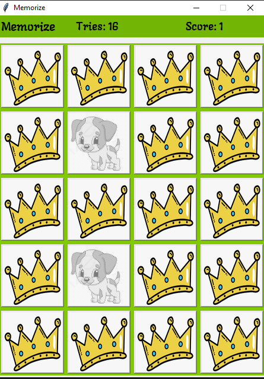

# MEMORIZE

A simple memory game to kil your time, with sole challenge of getting all the matches in the least amount of time.




## Table of contents

  - [Description](#DESCRIPTION)
  - [External packages](#EXTERNAL-PACKAGES)
  - [Usage](#USAGE)
  - [Author](#AUTHOR)

## Description

  The memorize app is made completely in python and using an inbuilt GUI framework, Tkinter, with some exceptions.

## External packages
  The external package used in the project is pyglet.
  pyglet is used to load a external font file, the file will run even if the package is not installed.

  To install the package type this command in the terminal or cmd.

  ```bash
  pip3 install pyglet
  ```

## Usage
   - Using the source file.
         
        Download or clone the [Repo](https://github.com/Adwaith-Rajesh/Memorize) and then install the required package and the run the [main.py](./main.py) file with the command

        ```bash
        python main.py
        ```

  - Using the 64 bit windows executable.
  
      Download the executable from this link and
      extract the file by executing the file and run
      the memorize. exe from within the folder, as
      the all the files required are present in the folder.

## Author

Click [here](https://github.com/Adwaith-Rajesh) to meet to know me.